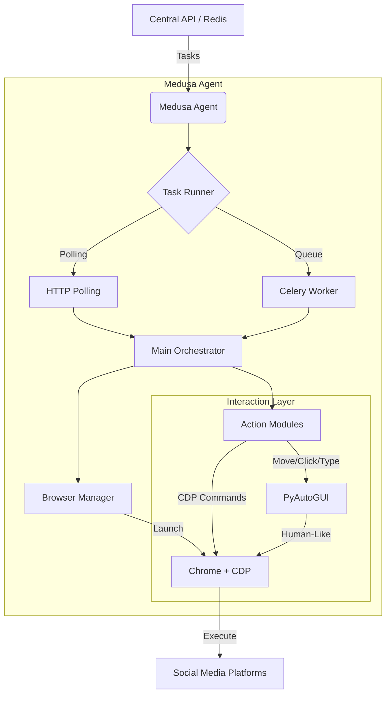

# 🐍 Medusa: Human-Like Social Media Automation

Medusa is a powerful, Python-based browser automation system designed for high-stealth social media interactions. It combines **Chrome DevTools Protocol (CDP)** for deep browser control with **PyAutoGUI** for human-like mouse and keyboard movements, making it nearly indistinguishable from a real user.

> [!IMPORTANT]
> This project is designed for automation across platforms like **TikTok**, **X (Twitter)**, and **Instagram**, featuring advanced anti-detection mechanisms and distributed task management.

---

## ✨ Features

- **🛡️ Advanced Stealth**: Custom anti-detection scripts (`stealth.py`) that spoof `navigator.webdriver`, `navigator.plugins`, and other browser fingerprints.
- **🖱️ Human-Like Behavior**: Uses Bezier curves, easing functions, jitter, and overshoot for mouse movements. Typing includes variable delays to mimic human rhythm.
- **🚀 Multi-Platform**: Built-in support for:
  - **TikTok**: Login, Like, Repost, Comment, Share.
  - **X (Twitter)**: Login, Post, Like, Reply, Search.
  - **Instagram**: Basic navigation and interaction.
- **🌐 Distributed Architecture**: 
  - **HTTP Polling Mode**: For local development and testing.
  - **Celery Worker Mode**: Production-ready, push-based task queue using Redis.
- **🔍 Precision Targeting**: Reliable element location using a hybrid CDP + Node.js/Puppeteer strategy to handle DPI scaling and browser UI offsets.

---

## 🏗️ Architecture



---

## 🚀 Quick Start

### 1. Prerequisites
- **Python 3.10+**
- **Node.js 18+**
- **Google Chrome** (Latest version)

### 2. Installation
```bash
# Clone the repository
git clone https://github.com/your-org/medusa.git
cd medusa

# Setup virtual environment
python -m venv venv
.\venv\Scripts\activate  # Windows

# Install dependencies
pip install -r requirements.txt
cd js && npm install && cd ..
```

### 3. Configuration
Copy `config.example.json` to `config.json` and update your settings:
```bash
copy config.example.json config.json
```

### 4. Running
**Development (Polling Mode):**
```bash
python main_tiktok.py --polling
```

**Production (Celery Mode):**
```bash
python main_tiktok.py --celery
```

---

## 📂 Project Structure

- `main_tiktok.py`: Primary entry point for TikTok automation.
- `browser.py`: Handles Chrome lifecycle and CDP communication.
- `action/`: Platform-specific automation logic (TikTok, X, Instagram).
- `stealth.py`: Critical anti-detection and fingerprint spoofing logic.
- `js/`: Node.js utilities for precise element coordinate calculation.
- `fake_api.py`: Local FastAPI server for testing task distribution.

---

## 📚 Documentation

Detailed guides for specific components:

- 🛠️ [Setup Guide](file:///c:/Users/okky.agung/Project/Automation/Repost/SETUP.md) - Full installation and configuration walkthrough.
- 🥷 [Stealth Mode](file:///c:/Users/okky.agung/Project/Automation/Repost/STEALTH_MODE.md) - How anti-detection works.
- ⚙️ [Celery Setup](file:///c:/Users/okky.agung/Project/Automation/Repost/CELERY_SETUP.md) - Distributed task queue configuration.
- 🖥️ [VM Infrastructure](file:///c:/Users/okky.agung/Project/Automation/Repost/vm.md) - Deployment context and VM specifications.

---

## 🛡️ Analogy
Each instance of Medusa is considered a **Device**. In a production environment, multiple Medusa instances run on separate Virtual Machines, each with its own proxy and browser profile, mimicking a fleet of independent physical devices.

---

*Built with ❤️ for advanced automation.*